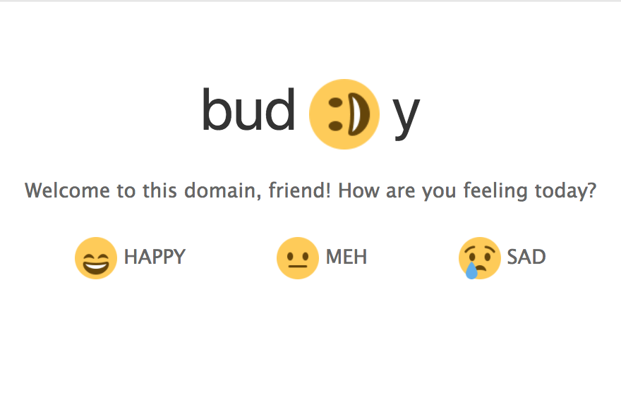

  <b>bud;Dy</b> is a really nice bot that can help you with anything you want (can't 100% guarantee).   
   
   
  
  <b>Stack</b>
  - [Node](https://.nodejs.org/en)
  - [Express](https://.expressjs.com)
  - [jQuery](https://.jquery.com)
  - [UIkit](https://.getuikit.com)
